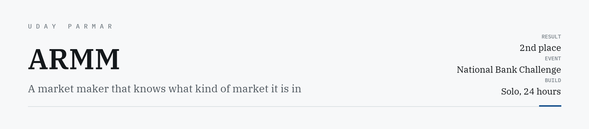
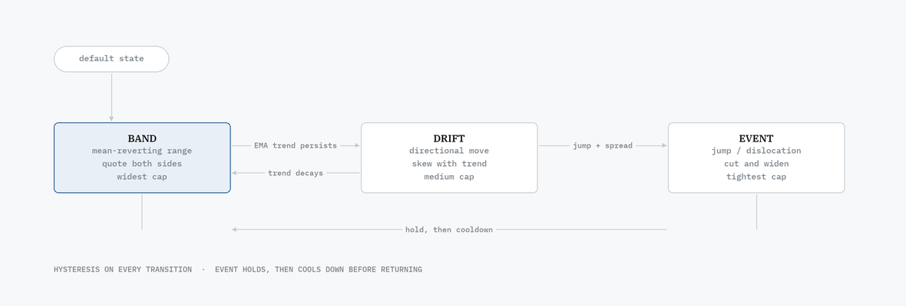

<picture>
  <source media="(prefers-color-scheme: dark)" srcset="assets/banner-dark.png">
  <source media="(prefers-color-scheme: light)" srcset="assets/banner-light.png">
  
</picture>

<p>
  
  
  
  
  <a href="https://uday-parmar.vercel.app/work/armm"></a>
</p>

A market maker that decides what kind of market it is in before it decides how to quote.

> **Credit first.** The exchange simulator (`app/`), the market scenarios, `manual_trader.py`,
> `API_REFERENCE.md` and the original skeleton were provided by the competition organisers.
> My work is the strategy in `student_algorithm.py` — roughly **1,100 of its ~1,260 lines**.
> This README describes that strategy, not the harness.

---

## The idea

A fixed spread is correct in exactly one market regime and wrong in every other. A quiet book,
a trending book and a dislocation each punish the same quoting policy differently, so the
policy has to know which one it is looking at.

## The state machine

<picture>
  <source media="(prefers-color-scheme: dark)" srcset="assets/states-dark.png">
  <source media="(prefers-color-scheme: light)" srcset="assets/states-light.png">
  
</picture>

`BAND` is the default it falls back to. The transitions carry **hysteresis**, and `EVENT` has
both a hold period and a cooldown — without them a single shock retriggers repeatedly and the
strategy spends the round whipsawing itself. Getting these thresholds stable took longer than
writing the quoting logic.

## Features that feed it

| Signal | Built from | Why not the obvious thing |
|---|---|---|
| **Band** | Rolling 5th/95th **quantiles** of mid | Min/max lets one print distort the whole range |
| **Trend** | **EMA** over mid deltas | Raw deltas flip sign on noise; the EMA requires persistence |
| **Volatility** | `min(mean, median, EWMA)` of `abs(dmid)`, floored | A single robust statistic; the floor stops it collapsing to zero |

## Inventory is a control variable

Inventory is not a number you report at the end — it is the thing you steer.

State maps to a **target inventory**, bounded by per-state caps (`EVENT` gets a tighter cap
than `BAND`). `TargetShaper` then **slew-rate-limits** movement toward that target, so the
strategy cannot chase its own signal. That one change did more for behaviour under the
stressed and flash-crash scenarios than any threshold tuning.

```
state ──▶ target inventory ──▶ slew limit ──▶ execution ──▶ quotes
            (per-state cap)      (rate cap)     (lot/price rounding,
                                                 self-cross prevention)
```

## Execution details that matter

Lot and price rounding to exchange rules. Inventory limits enforced **before** an order is
constructed rather than rejected after. Self-cross prevention, and cancellation of contra
orders before placing a quote that would trade against them. Quotes are only replaced when
the new price differs enough to be worth the message.

`hft_dominated` runs different `EVENT` thresholds from the other scenarios, because what
counts as a dislocation depends on the baseline.

## Running it

Requires the organisers' simulator in `app/`.

```bash
pip install -r requirements.txt
python student_algorithm.py --name <team> --password <password> --scenario normal_market
```

Scenarios: `normal_market` · `stressed_market` · `flash_crash` · `hft_dominated` · `mini_flash_crash`

## What I would change

The thresholds are hand-tuned per scenario. That works for a 24-hour competition and would not
survive contact with a real book. The honest next step is fitting them with a walk-forward
split, so the classifier is evaluated on data it was not tuned against — right now nothing
separates "the regime detection works" from "the constants were fitted to five scenarios."

---

<sub>Built by <a href="https://uday-parmar.vercel.app">Uday Parmar</a></sub>
